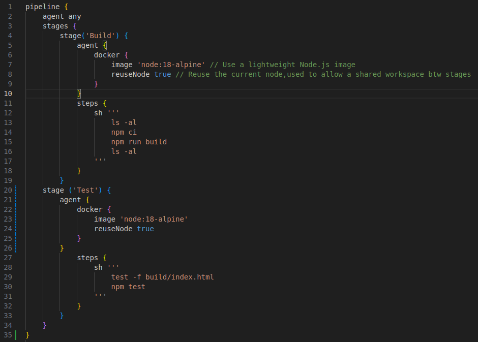
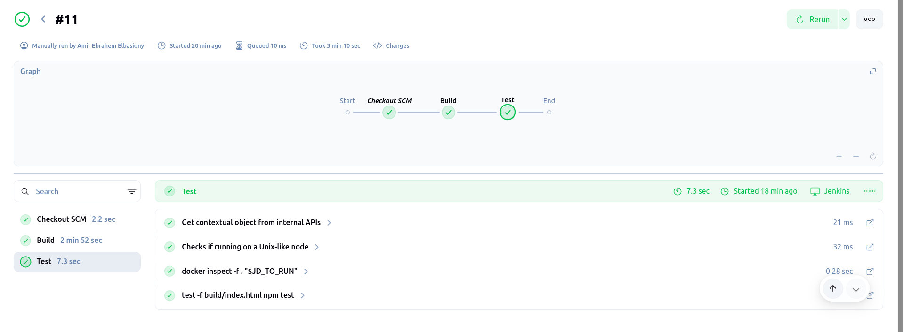
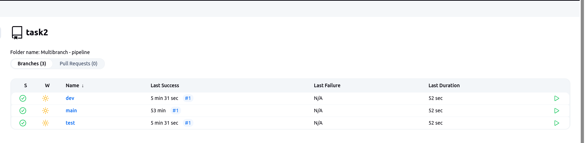

01) What scripting language is Jenkins pipeline syntax based on?
- Groovy Language

02) What are the ways you can write pipeline in Jenkins?
- Single Pipline
- Multibranch Pipeline

03) Create jenkins pipeline for your repo and use script file (jenkinsfile) to write pipeline syntax ? 

04) Create another multibranch pipeline and filter branches to contain only (master , dev , test ) ? 

05) create paramterized pipeline 

06) trigger jenkins pipeline from terminal 

07) activate webhook in github to send commits to jenkins 

08) run pipeline to make ec2 using terraform and by ansible run any script on it  all steps done through pipeline 

09) run pipeline to run bash script passed from jenkins-manged files to be run on private ec2 instance 

